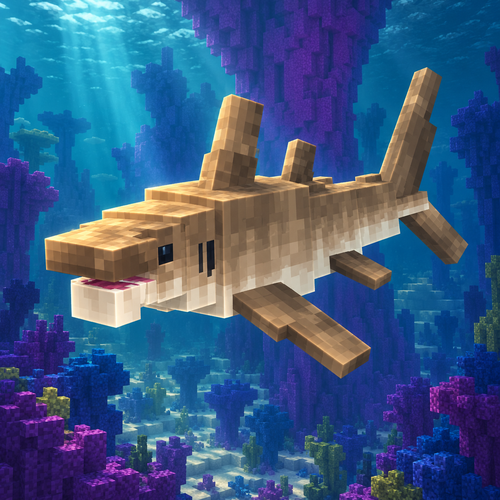

# Tidal Terror



Explore **Coral Cathedral**, a deep ocean biome with towering coral formations, irregular reef gardens, sandstone seabeds, and four animated marine creatures. Its deepest interior waters extend roughly 100 blocks below the surface, with some giant coral crowns reaching almost to sea level.

## Creatures and food

| Creature | What to expect |
| --- | --- |
| Coral Crusher | A shark that investigates, circles, bites, and charges at prey. It prioritizes players over drowned and fish, swims during attack recovery, and flees at low health before slowly healing when safe. Sandy skins spawn nearer the seabed; blue skins spawn higher up. |
| Cathedral Ray | A peaceful ray that glides in loose schools, approaches swimmers out of curiosity, and escapes predators. |
| Veilglow | A glowing jellyfish that drifts and pulses with nearby companions. Contact can sting; it does not chase players. |
| Shardback | A seabed crab that wanders, forages, warns nearby swimmers, and can pinch defensively before retreating. |

All four have custom spawn eggs in the **Tidal Terror** creative tab. The Crusher egg randomly chooses either skin. Each creature drops its own raw seafood, with a cooked version obtainable in a furnace, smoker, or campfire. Steak, ray wing, jellyfish gel, and crab claw restore more hunger after cooking.

## Install and explore

Requires **Minecraft 1.20.1**, **Forge 47.2.0 or newer in the 47.x series**, **Java 17**, and **[TerraBlender for Forge](https://www.curseforge.com/minecraft/mc-mods/terrablender)** for Minecraft 1.20.1, version **3.0.1.6 or newer in the 3.0.x series**. TerraBlender is required and is not bundled. Install both mods in the instance's `mods` folder; multiplayer needs both on the server and clients. This repository provides the Forge build.

Find Coral Cathedral in newly generated ocean chunks, or use `/locate biome tidalterror:coral_cathedral` with commands enabled. Existing chunks retain their terrain and structures. Reef structure fixes affect future generation. Dolphins, turtles, and tropical fish can spawn at reef depths alongside the new creatures.

Coral Crushers ignore Creative and Spectator players. Use Survival or Adventure to try their hunting behavior. Shaders are optional and are not required to play.

Version **1.0.0** is currently documented as unreleased. See the [changelog](CHANGELOG.md), [CurseForge page text](CURSEFORGE.md), and [release checklist](docs/Release-Checklist.md). A public download link will be added after publication.

## Feedback and license

Report problems on the [issue tracker](https://github.com/UpperMoon0/Tidal-Terror/issues), with mod/loader versions, reproduction steps, and the relevant log or crash report. Include the seed and coordinates for generation problems.

Author: **UpperMoon0 (Vo Nguyen Minh Nhat)**. Project code and art follow the existing **All Rights Reserved** policy in [LICENSE.txt](LICENSE.txt). The original Forge MDK notice is preserved separately in [LICENSE-Forge-MDK.txt](LICENSE-Forge-MDK.txt).

## Development

Requires Java 17. The Gradle wrapper downloads the Forge development dependencies on the first build.

```powershell
./gradlew.bat build
./gradlew.bat runClient
```

The release jar is written to `build/libs`. On Linux or macOS, use `./gradlew` instead.

Generate biome and feature data with `./gradlew.bat runData`. Generated registry JSON is tracked; runtime worlds and generator caches are ignored.

## Verification and previews

```powershell
./gradlew.bat -PcoralCrusherTests runGameTestServer
./gradlew.bat -PcoralCrusherModelTests verifyCoralCrusherAnimation
./gradlew.bat -PcathedralRayTests runGameTestServer
./gradlew.bat -PcoralCrusherModelTests verifyCathedralRayModel
./gradlew.bat -PveilglowTests runGameTestServer
./gradlew.bat -PcoralCrusherModelTests verifyVeilglowModel
./gradlew.bat -PshardbackTests runGameTestServer
./gradlew.bat -PcoralCrusherModelTests verifyShardbackModel
./gradlew.bat -PreefTests runServer
./gradlew.bat -PreefLifeTests runGameTestServer
./gradlew.bat -PfoodTests runGameTestServer
./gradlew.bat -PspawnPoolTests runGameTestServer
```

Run each test property separately; test and preview fixtures are excluded from normal release builds.

Development shaders are optional: run `python tools/install_dev_shaders.py` to install the pinned Oculus, Embeddium, and Complementary development dependencies. Downloaded dependencies are excluded from Git and the release jar.

After the native reef audit, `python tools/launch_reef_explorer.py` opens an independent copy of the audited reef with shaders enabled. Preview capture and packaging tools are in `tools`; generated galleries remain local under `art`.

See `docs/Coral-Cathedral.txt` and the Coral Crusher notes in `docs` for source references, behavior, and validation details.

The [Coral Crusher art workflow](docs/CoralCrusher-Art-Workflow.md) records the rig repair, animation, native UV export, ImageGen texture reconstruction, sandy variant, spawn egg, and validation process.

The [Cathedral Ray art workflow](docs/Cathedral-Ray-Art-Workflow.md) records its design, reproducible model/texture assembly, spawning, egg, and isolated native verification.

The [Cathedral Ray AI notes](docs/Cathedral-Ray-AI.md) describe peaceful cruising, loose schooling, player curiosity, predator avoidance, and safe recovery.

The [Veilglow art workflow](docs/Veilglow-Art-Workflow.md) records its hollow translucent bell, bloom core, ribbon animation, contact sting, artwork assembly, and native verification.

The [Shardback art workflow](docs/Shardback-Art-Workflow.md) records its shell, coral growths, leg/pincer rig, generated materials, seabed navigation, egg, and native verification.

The [predator AI notes](docs/CoralCrusher-Predator-AI.md) describe the encounter cycle, low-health escape, safe regeneration, and native regression coverage.

The [ambient AI notes](docs/Reef-Ambient-AI.md) describe Veilglow blooms and escape pulses, Shardback feeding and defensive warnings, safe recovery, and native regression tests.

Each reef mob drops its own food: Coral Crusher steak, Cathedral Ray wing, Veilglow gel, or Shardback claw. All have cooked versions obtainable in a furnace, smoker, or campfire and appear in the mod creative tab. The [food art workflow](docs/Reef-Food-Art-Workflow.md) records the textured model references, ImageGen prompts, paired 64x64 transparent exports, drop amounts, and native verification.

The [spawn egg art workflow](docs/Spawn-Egg-Art-Workflow.md) records the shared style reference, textured mob previews, ImageGen prompts, and transparent 64x64 exports for all four eggs.

The [spawn balance notes](docs/Reef-Spawn-Balance.md) describe separate population pools for each mod creature and reduced drowned spawning.
