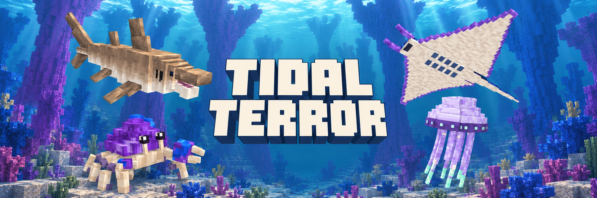

# Tidal Terror



Explore **Coral Cathedral**, a deep ocean biome with towering coral formations, irregular reef gardens, sandstone seabeds, and four animated marine creatures. Its deepest interior waters extend roughly 100 blocks below the surface, with some giant coral crowns reaching almost to sea level.

## Creatures and food

| Creature | What to expect |
| --- | --- |
| Coral Crusher | A shark that investigates, circles, bites, and charges at prey. It prioritizes players over drowned and fish, swims during attack recovery, and flees at low health before slowly healing when safe. Sandy skins spawn nearer the seabed; blue skins spawn higher up. |
| Cathedral Ray | A peaceful ray that glides in loose schools, approaches swimmers out of curiosity, and escapes predators. |
| Veilglow | A glowing jellyfish that drifts and pulses with nearby companions. Contact can sting; it does not chase players. |
| Shardback | A seabed crab that wanders, forages, warns nearby swimmers, and can pinch defensively before retreating. |

All four have custom spawn eggs in the **Tidal Terror** creative tab. The Crusher egg randomly chooses either skin. Each creature drops its own raw seafood, with a cooked version obtainable in a furnace, smoker, or campfire. Steak, ray wing, jellyfish gel, and crab claw restore more hunger after cooking.

## Reef equipment (0.0.2)

Coral Cathedral supplies an **iron-to-diamond specialist equipment branch**. Coral Crushers drop 1–2 **Crusher Teeth**, and Shardbacks drop 1–2 **Shardback Plates**, alongside seafood. Looting can increase the material drops. Living Shardbacks also shed a plate while safely foraging on submerged sediment after 5–6 minutes of loaded underwater time; keep a respectful distance so they can forage. The initial molt takes five minutes, and cooldowns persist across saves.

Combine these materials with **iron ingots and dead coral blocks** at a crafting table; the spear also needs leather. Any of the five vanilla dead coral block varieties works. Isolate a coral block from adjacent water to let it die, then mine the dead block with a pickaxe; Silk Touch is not required for the dead block. Collecting teeth or plates unlocks their recipes in the recipe book. Teeth repair the spear; plates repair the armor.

| Equipment | Strength and specialty |
| --- | --- |
| Reef Spear | 6 attack damage, 1.1 attack speed, 250 durability, and +1 block of entity reach in the main hand. Fully charged hits apply 2 bleeding damage over 4 seconds when both attacker and target are in water. Repeated hits refresh one bleeding effect. Supports weapon enchantments except Sweeping Edge. |
| Reef Armor | Helmet/chestplate/leggings/boots give 2/6/5/3 armor (16 total), zero toughness, and iron-equivalent durability. Each piece reduces knockback by 5% while standing on submerged ground, up to 20%. Works with mixed equipment; ordinary armor protection also applies on land. |

The equipment inherits the mobs' materials: an ivory tooth and sandy bindings for the spear; violet Shardback carapace, cobalt coral, ivory segments and slate joints for armor. Diamond remains the stronger general defensive tier. See [equipment artwork and verification](docs/Reef-Equipment-Art-Workflow.md).

**Serration I–III** adds 0.5 damage per level to each bleeding pulse. **Hemorrhage I–II** extends bleeding to six/eight seconds. Both are spear-only enchantments available through tables and books/anvils, and can be combined. All five book levels appear beside the spear in the Tidal Terror creative tab; book tooltips explain their level-specific bonuses and charged underwater-hit requirement. The spear tooltip shows its enchanted total. Coral Crusher bites also cause the base bleed: two damage over four seconds, with the same custom blood particles. The spear points forward in both hands. Bleeding produces custom blood droplets and dispersing underwater plumes with a dedicated status icon. See [sprite references, bleeding and enchantment details](docs/Reef-Sprites-and-Bleeding.md).

JEI loads automatically in the development client (`runClient`) for recipe inspection. It is optional development tooling and is not bundled into the release.

## Install and explore

Requires **Minecraft 1.20.1**, **Forge 47.2.0 or newer in the 47.x series**, **Java 17**, and **[TerraBlender for Forge](https://www.curseforge.com/minecraft/mc-mods/terrablender)** for Minecraft 1.20.1, version **3.0.1.6 or newer in the 3.0.x series**. TerraBlender is required and is not bundled. Install both mods in the instance's `mods` folder; multiplayer needs both on the server and clients. This repository provides the Forge build.

Find Coral Cathedral in newly generated ocean chunks, or use `/locate biome tidalterror:coral_cathedral` with commands enabled. Existing chunks retain their terrain and structures. Reef structure fixes affect future generation. Dolphins, turtles, and tropical fish can spawn at reef depths alongside the new creatures.

Coral Crushers ignore Creative and Spectator players. Use Survival or Adventure to try their hunting behavior. Shaders are optional and are not required to play.

Download **0.0.1** from [GitHub Releases](https://github.com/UpperMoon0/Tidal-Terror/releases/tag/v0.0.1). The [CurseForge project](https://www.curseforge.com/minecraft/mc-mods/tidal-terror) and its first file are awaiting moderator review. See the [changelog](CHANGELOG.md) for release changes.

## Feedback and license

Report problems on the [issue tracker](https://github.com/UpperMoon0/Tidal-Terror/issues), with mod/loader versions, reproduction steps, and the relevant log or crash report. Include the seed and coordinates for generation problems.

Author: **NsTut**. Licensed under the [MIT License](LICENSE.txt). The original Forge MDK notice is preserved separately in [LICENSE-Forge-MDK.txt](LICENSE-Forge-MDK.txt).

## Development

Requires Java 17. The Gradle wrapper downloads the Forge development dependencies on the first build.

```powershell
./gradlew.bat build
./gradlew.bat runClient
```

The release jar is written to `build/libs`. On Linux or macOS, use `./gradlew` instead.

To publish a new version, change `mod_version` in `gradle.properties`, add `changelogs/vVERSION.txt`, and push to `main`. CI runs native regression checks and packaging verification, then uploads to CurseForge and creates the matching GitHub release. Publication requires the repository secret `CURSEFORGE_API_TOKEN`.

Generate biome and feature data with `./gradlew.bat runData`. Generated registry JSON is tracked; runtime worlds and generator caches are ignored.

## Verification

```powershell
./gradlew.bat -PcoralCrusherTests runGameTestServer
./gradlew.bat -PcoralCrusherModelTests verifyCoralCrusherAnimation
./gradlew.bat -PcathedralRayTests runGameTestServer
./gradlew.bat -PcoralCrusherModelTests verifyCathedralRayModel
./gradlew.bat -PveilglowTests runGameTestServer
./gradlew.bat -PcoralCrusherModelTests verifyVeilglowModel
./gradlew.bat -PshardbackTests runGameTestServer
./gradlew.bat -PcoralCrusherModelTests verifyShardbackModel
./gradlew.bat -PreefLifeTests runGameTestServer
./gradlew.bat -PfoodTests runGameTestServer
./gradlew.bat -PspawnPoolTests runGameTestServer
./gradlew.bat -PequipmentTests runGameTestServer
./gradlew.bat -PcoralCrusherModelTests verifyReefEquipmentModel
```

Run each test property separately; test fixtures are excluded from normal release builds. The Validate workflow also runs the terrain audit in an isolated server with its documented seed and required server settings.

For equipment screenshots, prepare the optional development shaders, run `python tools/prepare_equipment_preview.py`, then use its printed client command. It opens a separate fresh preview world, captures native worn/held models, underwater first person in both hands, the creative tab and resource reload/glint, then exits. It does not open the ordinary development world.

Development shaders are optional: run `python tools/install_dev_shaders.py` to install the pinned Oculus, Embeddium, and Complementary development dependencies. Downloaded dependencies are excluded from Git and the release jar.
