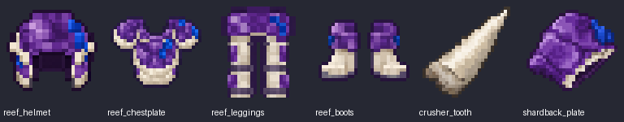

# Reef sprites and bleeding

The six item sprites were generated individually with built-in ImageGen. The
exact prompts and retained source paths are in
[`tools/reef_sprite_sources.json`](../tools/reef_sprite_sources.json).
`python tools/export_reef_sprites.py` exports the sources to transparent 64×64
item textures using 32×32 logical pixels and nearest-neighbor sampling.

References were actual native-game Shardback and Crusher images, the actual
front/side/back worn armor capture, and the user's vanilla armor silhouette
reference. Purple segmented carapace and cobalt coral come from the Shardback;
ivory plates and slate joints match the worn armor. The Crusher tooth is a
single ivory tapered tooth. Helmet, chestplate, leggings, and paired boots keep
vanilla's general item silhouettes instead of rendering a mannequin or cuboid.

## Bleeding

The custom blood particle has its own registered type, provider, and three
native 16×16 frames. Fresh droplets disperse, expand, and fade into a small red
plume underwater; droplets fall in air. Native translucent particle rendering
integrates with the existing Oculus shader pipeline and also works without a
shader pack. Server emission keeps nearby multiplayer clients in sync; normal
particle distance and quality settings apply. Blood remains local to the wound,
with small ongoing trails and a burst on each damage pulse. Potion swirls are
disabled; a dedicated blood-drop status icon remains visible.

## Spear enchantments

Both are available through enchanting tables and enchanted books/anvils, only
on the Reef Spear. They are compatible with each other and existing weapon
enchantments. They retain the charged underwater-hit gate and refresh one
effect rather than stacking independent bleeds.

| Enchantment | Bonus |
| --- | --- |
| Serration I–III | Adds 0.5 damage per level to each two-second bleed pulse. Over four seconds, total damage becomes 3/4/5 instead of 2. |
| Hemorrhage I–II | Extends duration to six/eight seconds, adding one/two pulses. |

Together at maximum level, four 2.5-damage pulses deal 10 damage over eight
seconds. The spear tooltip calculates its actual enchanted total and duration.
A weaker hit cannot downgrade an active stronger effect. Enchantment values
from edited NBT are clamped to the supported levels.

Eight native equipment GameTests cover the original six equipment regressions
plus enhanced bleed timing, stronger-effect preservation, suppressed potion
particles, native enchanting-table candidates, and actual anvil/book assembly.

## Development JEI

JEI 15.20.0.118 loads through `localRuntime` in development clients. It follows
the [official JEI setup for Minecraft 1.20.1](https://github.com/mezz/JustEnoughItems/wiki/Getting-Started-%5BMinecraft-1.18.2-to-1.20.1%5D).
It is excluded from native server test runs and is not declared as a required
mod dependency or bundled into the released JAR. All five shaped equipment
recipes use vanilla crafting and are discovered by JEI without a custom plugin.
