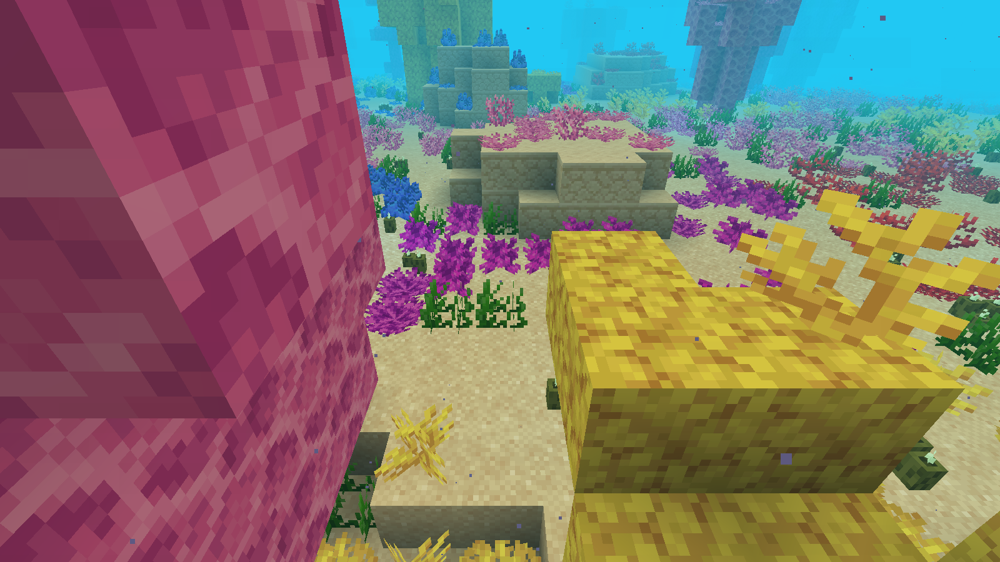

# Sunken Wastes and the Reef Province

First draft and Forge 1.20.1 prototype, 2026-10-08. Based on main `133c112`.

## Current Endless-backed deep preset

The latest Forge 1.20.1 prototype requires **Endless 0.9.3** on both client and server. Select **Deep Reef Province (Endless Prototype)** when creating a new world (`tidalterror:reef_province_deep` on a server). TerraBlender is absent from the experimental runtime. The earlier shallow preset remains selectable for comparison; the depth descriptions further below record that earlier pass.

Cathedral retains its 1,024-block nominal radius and existing roughly 100-block giant coral height. All outer horizontal bands retain the proportional enlargement. The deep profile lowers the core toward Y −448, climbs through a rim crest near −256 (with deeper passages), then climbs through the Inner Wastes toward −144 and the Outer Wastes toward ordinary seabed. Dunes and angular warping vary those heights.

One shared depth profile places the seabed, rock and bedrock. Inside the flooded basin, generation replaces the ordinary Y −64 bedrock with water and continues into Endless's sparse sections. Bedrock follows the seabed 12 blocks below it, with a deterministic 4–6-block thickness below Y −64 to connect neighboring steps. The outer sides are solid deepslate below the ordinary floor. Outside accepted provinces, this generator writes nothing: vanilla bedrock and terrain remain intact, and no sparse terrain pages are allocated there.

Configure Endless **before creating the world** with `buildHeight.minBuildHeight` at or below −512; the development fixtures use −1024 and a maximum of 1024. This version generates a bounded foundation down to −512 rather than filling the entire configured height range. The ordinary dense chunk array remains 24 sections. Do not apply this preset as an existing-world migration: saved chunks are loaded without regeneration, and the sparse generation hook runs only when a fresh protochunk becomes a full chunk.

The generic void-fog correction now belongs to Endless. The prototype no longer contains `DeepProvinceFogMixin`: Endless chooses its configured logical floor whenever sparse mode is active, for every biome and in air as well as water. Tidal Terror remains responsible for biome water colors and any future depth-specific atmosphere.

Endless 0.9.3 is an unreleased PR build. Build `:forge-1.20.1:remapJar` in that checkout, then copy `endless-forge-1.20.1-0.9.3.jar` into this project's `.dependencies/endless` directory. Gradle checks its Forge metadata and refuses an older dependency. The jar is neither committed nor bundled; install it and Architectury on both client and server. This version has not been merged or published.

```powershell
# After installing the local Endless 0.9.3 PR jar:
.\gradlew.bat -PprovincePrototype build

# Isolated native generation, then a separate process loading the saved world:
.\gradlew.bat -PprovincePrototype -PdeepProvinceTests runServer --offline
.\gradlew.bat -PprovincePrototype -PdeepProvinceTests -PdeepReload runServer --offline

# After both checks, open an independent copy for an in-game tour:
.\gradlew.bat -PprovincePrototype -PdeepProvinceExplore runClient --offline
```

The native fixture resets only its named world under `build/deep-province-test` on the first command; `deepReload` preserves that world. It checks deep sediment and bedrock, the dense/sparse water join, ordinary outside bedrock, unchanged dense array sizes, sparse biome and height queries, giant living coral, buried Wastes skeletons, active ticking, and preservation of a player edit after restart. The exploration fixture is excluded from packaged jars and preserves its independent save after first import.

This is a Forge 1.20.1 worldgen prototype. Other loader/version ports still use their existing adapters. The deep extension supplies rock, sediment, water, giant coral and the full legacy reef garden/decorations described below, plus buried dead coral. It does not generate a new ore or cave system. Native noise-generator base-height/column queries used by structure planning still describe vanilla terrain, so structures are disabled in the audit. Structure integration, cave biome preservation and generation performance remain promotion gates. Surface islands/coasts inside an admitted province can be excavated; unchanged ordinary terrain means **outside the province footprint**.

### Legacy Cathedral feature recovery, 2026-10-09

The first deep pass copied giant coral bodies and substituted isolated floor fans for `ReefGardenFeature`. That omitted clustered branching/layered/folded colonies, rounded sandstone outcrops, coral plants, seagrass, sea pickles, the original five-color spatial field and giant crown fans.

The deep worker now calls the same `ReefGardenFeature.decorate` and `CoralCathedralFeature.decorate` used by the legacy native features, in the same order (gardens before giants). Seed rules, density field, three small-colony forms, boulder chance, five colors, support checks, plant mixture and crown-fan rules come directly from the original implementations. Native generation uses a native block view; the deep worker uses a private view of its pending sections, with terrain-only halo reads that never request neighbouring chunks. Writes remain confined to the owning chunk and precede bulk admission. The Cathedral footprint and tall-coral height cap remain unchanged. Sand thickness now also uses the original coordinate rule.

The published 0.0.3 (`133c112`) biome inventory remains the reference: the native feature graph, inherited carver registrations and all spawn tables are retained, not replaced by a short reef-only list. A frozen native inventory regression checks those three fields against the actual loaded biome. The recovery does not invent underground features absent from the original flooded basin: its RAW excavation already filled the interior's former caves with sandstone before decoration, and filtered magma, geodes, kelp and several native aquatic decorators. Deep structure/cave integration remains a separate limitation.

Existing generated pages are preserved, so already saved bare terrain is not retroactively decorated. Review this change in a new world or an independent copy of the newly audited world. Never overwrite the preserved v4 exploration/benchmark saves.

Final native fresh generation and a separate-process cold reload passed, including the frozen legacy inventory, all five coral colors and crown fans. A 48×48 sample contains 730 living coral blocks, 435 boulder blocks, 373 coral plants, 377 fans, 189 seagrass and 102 sea pickles. Those counts remain identical after 200 active ticks and restart; forced native coral ticks preserve living states, and every sampled plant has valid support and water. Admission builds remain zero.

The independent **Deep Reef Province Exploration v5** client completed five framebuffer captures and five active-water scans. Its low garden camera shows the recovered terrain:



Capture uses vanilla rendering, Creative flight and Night Vision. Reproduce the close-up tour after the fresh/reload audits with `./gradlew.bat -PprovincePrototype -PdeepProvinceExplore -PprovinceProfile -PreefGardenReview runClient --offline`. The profile exits after completion; omit `provinceProfile` to keep the review world open. The v5 copy is imported only when absent, preserving previous review saves.

The [post-recovery smoke metrics](performance/2026-10-09-reef-recovery.json) record frame p95 53.45 ms, tick p95 60.20 ms, worst heartbeat 481.71 ms and a 1,768.72 ms worst frame. This is one run with a different audited save, garden camera and 1600×900 framebuffer, not a matched comparison with the historical ABBA runs. Timing regressions remain a promotion gate.

### Fog ownership migration, 2026-10-09

The generic correction is in [Endless PR #24](https://github.com/UpperMoon0/Endless/pull/24), targeting its `master` mainline and kept unmerged. Endless has been bumped from 0.9.2 to 0.9.3. The two older Minecraft versions share one client hook; 26.1.2 has a separate target matching its changed fog API. Floor-policy regressions, all five packaged jars, and Endless tooling passed locally.

Tidal Terror rebuilt successfully with no local fog class or mixin registration and mandatory Endless `[0.9.3,0.10)` metadata; its 24 tooling tests passed. A cold client launch on the preserved v4 save using the new Endless jar completed all five captures and five active-water scans. Wastes and Cathedral water below the dense floor retained color in the actual framebuffer. The run still uses Creative flight and Night Vision; generic air, unassisted visibility, every terrain mesh, shaders and other versions' native pixels are not certified by this tour. One catch-up warning reached 17 seconds, so performance remains unresolved. Earlier 0.9 results below are historical evidence, not new 0.9.3 server audits.

### Performance implementation, 2026-10-09

Endless PR #24 now owns the general engine changes as well as logical-floor fog: a 512-entry section-light cache, copied palette inputs and solves outside sparse storage locks, immediate dense-write invalidation, bounded immutable snapshot reuse, bulk generated-page admission, fair initial page delivery, and budgeted periodic persistence. Explicit saves, unload and shutdown still persist pending dirty pages. The logical height does not dictate the amount of work; actual populated sections still do.

Tidal Terror owns the terrain-specific changes: exact native seabed heights grouped into a bounded 2,048-chunk cache, noise computation outside the shared LRU lock, deep-section preparation on native generation workers, and short bulk admission without encoding/decoding a network snapshot. Its seabed and bedrock formulas remain the same. Preparation runs only for a requested native FULL continuation, including saved protochunks that have already passed decoration; decoration neighbors do not eagerly construct private deep terrain. A native regression requires zero admission builds, so omitting worker preparation cannot silently pass the audit.

The optimized Forge 1.20.1 fresh-generation audit passed, followed by a separate JVM cold reload preserving the gold-block player edit. Native regressions cover cross-section lighting, the dense/deep seam, opaque enclosure and removal, immutable render-light copies, and refusal to replace an existing page. The new pure cache regression covers exact values, reuse, eviction, independent-chunk concurrency and failure retry. All 24 Tidal tooling tests pass; Endless has 212 Java cases (two existing skips) and 82 tooling tests passing locally.

CI builds the exact Endless commit recorded in `tools/endless-source.json`, shares its unbundled Forge jar with normal/native/prototype builds, and runs a fresh/cold deep audit. Both mods remain unreleased: Endless 0.9.3 and Tidal Terror 0.0.4 are draft PR builds.

The completed [four-run in-game benchmark](performance/Deep-Province-2026-10-09.md), recorded before the full garden recovery, reduced frame p95 in both pairs (25.7% and 72.6%) and reduced the worst server heartbeat gap across runs from 2,219 to 489 ms. Tick p95 and longest individual frame regressed. Those timings do not certify the richer recovered terrain. The report preserves every independent result and raw metric; this remains an opt-in draft and is not ready for production promotion.

### Performance investigation, 2026-10-09

The configured logical height is separate from the amount of populated terrain. Endless keeps fresh worlds' dense arrays at 24 sections and sparse height queries iterate allocated pages; its point-light search has a fixed radius of 14 blocks. Widening the empty logical range does not allocate or scan every intervening section in these paths. This does not make deep terrain generation, lighting, synchronization or rendering free.

Three native Forge 1.20.1 client runs were profiled using Java Flight Recorder, without shader/renderer replacements. The two height-limit controls started from independent identical copies of the same v4 save, ran in separate JVMs, used the same seed/poses/render distance 4/simulation distance 5, and completed all five framebuffer captures and active-water scans. The first control's configuration was [-1024,1024); the wider control logged an effective [-1048576,1048576) range with 24 dense sections. Night Vision and Creative flight were enabled. Analysis windows exclude mod-loading startup and stop at the final tour capture.

| Observation | [-1024,1024) | [-1048576,1048576) |
| --- | ---: | ---: |
| Largest server catch-up warning | 7,880 ms | 14,647 ms |
| Client/render-worker samples containing `computeBlockLight` | 3,393 / 6,304 (53.8%) | 3,047 / 5,796 (52.6%) |
| Server samples containing `ReefTerrain.originalFloor` | 449 / 1,975 (22.7%) | 454 / 2,143 (21.2%) |
| Largest stop-the-world GC pause | 76 ms | 67 ms |
| Completed captures / active-water scans | 5 / 5 | 5 / 5 |

The wide run's first-stall window had `ReefTerrain.originalFloor` in 454 of 1,089 server samples (41.7%), and `DeepProvinceGenerator.generate` in 388 (35.6%); these are overlapping inclusive stack counts, not additive percentages. The repeated vanilla noise-column height calculation is a concrete server hotspot. It runs under the shared `NOISE` cache lock, including generation at the outer blend and runtime spawn-height selection. Cache misses call `ChunkGenerator.getBaseHeight` one X/Z point at a time. A saved-world tour still admits new fringe chunks, so this is not a pure no-generation steady-state test.

Endless's vanilla sparse-light path is a concrete client hotspot. `EndlessLayerLightEventListener.getLightValue` calls synchronized `MinecraftVerticalWorld.getBrightness`; each uncached block-light target searches 4,089 cells in its radius-14 neighborhood before any propagation. Render workers and the render thread contend for the same client vertical-world monitor. The existing palette-aware batch light snapshot is used by the optional Embeddium adapters, but the vanilla point-light route used here does not use it. This is an Endless optimization gap for a large continuously populated basin, rather than a scan of the million-block configured height.

Tidal Terror also constructs 28 sparse sections (114,688 block cells in a fully admitted chunk) on the proto-to-FULL conversion path, then encodes and decodes those sections through a network snapshot to install them. That conversion runs during chunk admission; a dimension-wide height change does not change this fixed -512..-65 construction window. Snapshot installation and persistence/sending are additional source-confirmed costs, but they were not the largest sampled hotspots and their isolated costs have not been measured.

Prioritize a reusable bounded section-light cache/batch solve in Endless, with correct dense/sparse boundary behavior and edit invalidation, and batched or reusable native seabed-height data in Tidal Terror without holding a global cache lock while evaluating noise. Then replace Tidal Terror's network-snapshot installation round trip with a supported bulk worldgen install API, and keep expensive generation work off the admission burst where possible. Preserve terrain, bedrock, lighting and cold-reload behavior in regression tests before promotion.

These observations do not establish identical performance for different height limits. The one-pair desktop test includes JVM warmup, profiling overhead, background workload and varying chunk-admission scheduling; catch-up warnings are accumulated server lag rather than an individual frame or tick duration. No production fix or promotion is claimed. The fog-only Endless PR remains separate and unmerged.

Raw recordings are `build/deep-province-workspace/build/deep-province-explore/province-perf-narrow.jfr` and `province-perf-wide.jfr`. Log files are `deep-perf-narrow.log` and `deep-perf-wide.log` in that workspace. Its `build/profile-narrow-summary.txt`, `build/profile-wide-summary.txt`, `build/profile-wide-first-stall-summary.txt` and `build/performance-comparison.json` retain the sampled evidence. A streaming JFR reader in `build/ProfileSummary.java` avoids materializing the very large JSON event export. Profiling and save-selection changes remain confined to the development snapshot; release code is unchanged by this investigation. The original v4 save is preserved, test copies were closed cleanly, and the development config was restored to [-1024,1024).

### Deep generation checks, 2026-10-08

The standalone deep layout check passed **7,290,000 positions** across six seeds, with cardinal bedrock overlap, bounded foundation depth, smooth adjacent steps and unchanged shallow-profile behavior. Native Forge fresh generation and a separate cold-reload process passed against the published Endless 0.9 jar with TerraBlender absent. At seed-0 center X −55,689, Z 43,535, the sampled floors were −447 (core), −380 (rim passage), −244 (Inner Wastes) and 7 (outer approach). The first three sampled bedrock bases were −459, −392 and −256. The ordinary outside control retained bedrock at −64 and no sparse page. The 24-section dense arrays were preserved.

Both native passes checked active ticking over 81 columns at each of four zone samples, including the −64/−65 water seam. Cold reload retained a player-placed gold block in the deep Inner Wastes. Native landmark witnesses found living giant coral at Y −358 and buried dead coral at Y −336. These are representative probes, not province-wide coverage or a multi-seed native survey.

The experimental jar built successfully with required Endless metadata, both world presets, five common province/deep mixin hooks plus a client-only fog hook and their remapping data, and no audit/exploration classes. The normal build also passed and retained its legacy adapter while excluding prototype presets and hooks. Repository tooling passed 24 tests. Rendering results are recorded separately after the client tour; these server and archive checks do not establish appearance or performance.

The first deep client tour completed five views and all five ticking-water scans, but exposed vanilla void-fog darkening below the dense Y −64 floor. The target-version `FogRenderer.setupColor` bytecode confirms its use of `ClientLevel.getMinBuildHeight` for that darkening. The initial prototype's temporary client hook substituted Endless's logical floor only while the camera is in water below the dense floor in Cathedral/Wastes biomes. That first workaround retained the existing water fog, effects and normal-world calculation elsewhere; it has since been removed in favor of the generic Endless hook. Render readiness checks use a section in front of the camera; buried/offscreen sections can stay uncompiled indefinitely. The fixture uses the native minimum supported client simulation distance of five chunks.

The final saved-world client retest passed all five captures and five active-water scans with the fog fix. Before each capture it also verified actual sand and non-air blocks above the seabed at nine client positions across a 96-block square, so a dense chunk packet alone cannot satisfy sparse terrain readiness. The nearby section in front of the camera had compiled. The captures use Creative flight and Night Vision; unassisted deep visibility and the appearance of the entire province remain separate review work. Captures and `manifest.json` are in `build/deep-province-workspace/build/deep-province-explore/captures`. The independently saved **Deep Reef Province Exploration v4** was left at X −55,689, Y −417, Z 43,535 for underwater review.

Deep client runs still reported catch-up stalls of roughly 2–13 seconds. During a concurrent extra dedicated-server reload, warnings reached about 38 seconds; that extra run was interrupted after terrain/landmark probes and is **not** counted as a completed reload audit. The earlier standalone fresh-generation and cold-reload audits completed successfully. The client-only fog hook also loaded on a dedicated server without attempting to load client classes. These observations do not establish acceptable generation or gameplay performance. The prototype remains opt-in and is not ready for promotion to the default or a multi-loader release.

The Wastes are the long, quiet approach to Coral Cathedral: pale dunes, buried coral skeletons, then a broken dead-reef wall around the colorful basin. The Cathedral keeps its existing giant coral geometry and height, with a large horizontal footprint anchored to the recorded legacy patch survey. Preparation, visibility, terrain and creatures create the progression; players can still deliberately dive straight into the center.

## Layout

One seeded province contains every zone. Distance is measured against the same angularly warped boundary, so independently placed biome patches cannot cut holes through the ring.

| Zone | Draft radius from center | Floor and landmarks | Ecology |
| --- | --- | --- | --- |
| Cathedral | 0–1,024 blocks | Existing basin near Y -49; current giant coral and gardens | Existing reef ecosystem; prototype spawns Rays, Veilglows and Crushers in the lower water column |
| Dead Reef Rim | 1,024–1,593 | Broken escarpment rising toward Y 0, with three broad low passages | First Crusher territory; bleached skeleton silhouettes |
| Inner Wastes | 1,593–2,389 | Low sandy shelf near Y -18; open valleys below the rim | Sparse Shardbacks and ordinary fish; stronger environmental warning is a later pass |
| Outer Wastes | 2,389–3,413 | Shelf rising toward Y 18; outermost 569 blocks blend back into native seabed | Mostly empty; sparse Shardbacks and ordinary fish |
| Ocean | Beyond 3,413 | Native delegate biome and terrain | Native ecology |

The original TerraBlender Cathedral has no fixed radius. The recorded native survey in `Reef-Spawn-Balance.md` measured a largest connected patch of approximately 3.3 km² and a maximum span of 3,200 blocks. The new 1,024-block model radius gives approximately 3.3 km² of core area before angular warping. This preserves the scale of a large legacy Cathedral, rather than reproducing its irregular boundary or every old patch size.

All horizontal bands and terrain transition widths use the same factor, 1,024 / 180 (about 5.69), relative to the first prototype. These are model radii, not exact circles: the boundary varies by about 11%. Nominal province diameter is 6,827 blocks, with roughly 2,389 blocks of approach between its outer edge and the Cathedral. Candidate centers occupy a 12,288-block grid with seed-derived offsets up to 1,024 blocks. Even the maximum warped ring stays inside its placement cell; neighboring provinces cannot overlap. Placement frequency remains a tuning question. Coral height, local dune wavelengths, and landmark density retain their existing scale.

The rim is deliberately higher than the Inner Wastes. Swimming toward the Cathedral reveals a wall, a passage, then the basin drop. The three passages currently follow a simple three-fold angular field. A later pass should vary their orientation and widths by seed so every province does not share the same compass alignment.

## Appearance

- Pale sand dunes with long, gently curved ridges. The prototype uses continuous waves, with larger amplitude outside the core. A later terrain pass should introduce broader dunes and erosion channels.
- Smooth sandstone and grey dead coral skeletons. Landmarks reuse the Cathedral's staghorn, chalice and fan geometry at 16–28 blocks high, buried four blocks into the sediment. Their anchor grid is 144 blocks with a 24% occurrence chance, preserving broad empty stretches.
- Muted water `#648f91` and blue-grey water fog `#304f60`, contrasting with the existing turquoise Cathedral. These colors need in-game visual review; biome colors alone do not provide a continuous thermocline.
- No living coral garden or seagrass blanket in the Wastes prototype. Awakening reef pockets near the inner boundary are a planned art pass.

Future landmarks: exposed sandstone spires, dune graves, occasional blue holes, and rare living oases. Suspended sediment and visible currents should reinforce the routes once the terrain works. Actual current forces, depth-dependent fog, new enemies, resources and equipment gates are outside this first implementation.

## Implementation in this branch

The selectable **Reef Province (Prototype)** world preset wraps vanilla Overworld multi-noise with `ReefProvinceBiomeSource`. It owns province placement and both biome assignments. Nether and End retain their vanilla sources. The new source has a native codec, so world serialization records its delegate and both biome holders.

`ReefProvinceLayout` is shared, pure Java geometry. `ReefProvinceAccess` lets the existing terrain system recognize the opt-in source without coupling every loader to the Forge prototype class. `ReefTerrain` uses the province field for depth, but retains the released terrain calculation for other biome sources. The existing basin and water finishing features now recognize the full province. Living giant corals and gardens remain restricted to the Cathedral.

The actual world seed is bound to the native `Climate.Sampler` when `RandomState` is constructed, and propagated to the separate chunk-cached sampler used by native `NoiseBasedChunkGenerator.doCreateBiomes`. Province admission always uses the canonical sampler, avoiding chunk-cache-dependent placement. Weak keys avoid retaining closed worlds. The source delegates unchanged if it receives an unbound sampler. Its bounded eligibility cache keys both seed and center.

The earlier small-core prototype required its entire footprint to fit sampled vanilla ocean. That requirement already made a 600-block outer radius scarce and rejected all 3,721 tested candidates at 900 blocks. Enlarging the Cathedral must not be undone to satisfy that admission rule.

The revised source accepts ocean-dominated provinces: the center must be ocean, at least 75% of samples within the core envelope must be ocean. The sampled core disk includes the maximum 11% angular expansion, at 128-block spacing. The outer bands do not require vanilla ocean coverage: a first native search found no candidates among 3,721 cells when requiring even 50% ocean across the enlarged full envelope. One cached decision admits or rejects the entire province, preserving every complete ring. **Accepted provinces can contain islands and substantial coastal land in their outer bands that the basin feature excavates.** These thresholds are experimental; they do not preserve coastlines or guarantee placement rarity. A future density-driven ocean domain or stricter measured placement policy is needed before making this default.

This prototype keeps basin excavation in `RAW_GENERATION`, as the released mod does. It does not reshape native density functions. For accepted provinces, excavation now also clears the original above-sea surface when it crosses coastal land, avoiding floating terrain roofs. Outer transition columns can retain a dry shore when their blended native floor rises above sea level. Consequently native height queries and structure planning still see the original noise terrain. Existing Cathedral structure adaptations remain in place, but Wastes structures are not enabled yet. Moving the terrain into the noise pipeline is a separate design decision after the province layout is validated.

The source currently assigns province biomes through the subterranean region down to the normal minimum height. Full cave-biome preservation under the new seabed needs another pass. Flooded quart cells are resolved to the intended zone during excavation. Existing worlds and existing saved chunks are not regenerated.

## TerraBlender migration

The Forge experimental build runs without TerraBlender. `-PprovincePrototype` changes TerraBlender to a compile-only dependency, marks it optional in Forge metadata, removes the TerraBlender-dependent distribution mixin from the built config, and includes the preset and Wastes data. A resource marker disables the isolated legacy integration in the packaged experimental jar as well as development runs.

Normal builds retain mandatory TerraBlender and the released ocean-replacement path. Public release dependency metadata and the Fabric/NeoForge adapters retain their current requirements. A prototype proves that the province approach can stand independently; it does not complete removal across the supported release matrix.

Do not switch an existing save between the released and prototype generators. Use a new world. A release migration needs an explicit old-world policy, a versioned province algorithm, every loader adapter, and updated publication dependencies. Avoid changing the seeded radii after a world has generated adjoining chunks: that creates terrain seams.

## Running and reviewing

Forge 1.20.1 uses the repository's Java 17 toolchain.

```powershell
# Native normal-world audit with TerraBlender absent:
.\gradlew.bat -PprovincePrototype -PprovinceTests runServer --offline

# Interactive review: select Reef Province (Prototype) in a NEW world.
.\gradlew.bat -PprovincePrototype runClient --offline

# Produce a distinctly named experimental jar:
.\gradlew.bat -PprovincePrototype build --offline

# Layout invariants and a model preview:
javac -d build/province-model common-universal/src/main/java/com/nhat/tidal_terror/worldgen/ReefProvinceLayout.java tools/province/ProvinceLayoutCheck.java
java -cp build/province-model ProvinceLayoutCheck
```

For the automated native exploration tour, run `./gradlew.bat -PprovincePrototype -PprovinceExplore runClient --offline` after the successful native audit (with its output recorded in `build/province-scale-audit.log`). The tour imports an independent save into `build/province-explore/saves/Reef Province Exploration v2` only if it does not exist; subsequent launches preserve that exploration save. It uses vanilla rendering, captures four underwater approach views and one Cathedral surface view into `build/province-explore/captures`, checks sampled water columns after active ticking, and returns control to the player. The `provinceExplore` source set is excluded from release builds. To review a generator revision, create a new exploration copy rather than relying on old generated chunks.

The standalone check writes `build/province-model/layout.svg`. That preview is sampled from the implemented geometry; it does not depict Minecraft rendering or ocean admission. The native audit uses its private `build/province-native-test/province-test-world`, seed 0, structures disabled, and server port 25579. Only that named test world is reset. Completion requires `passed.txt`, not merely a clean server exit.

The audit checks preset loading, absence of TerraBlender, world seed binding, biome-source codec round trip, normal-world feature ordering, all five zones, actual generated sediment/water/biomes in four representative chunks, and predator depth/outer-ring rejection. The independent layout check samples six seeds, negative grid cells and every three degrees around 150 candidate centers, checking ordered complete rings, repeatability, outer blending and bounded terrain changes.

## Before making it the default

1. Inspect the in-world approach from the Outer Wastes, rim passages and Cathedral, including boat-level views and existing full-height coral.
2. Survey province frequency and sampled coast/island violations across seeds; add a reliable placement diagnostic so finding a province is easy during review.
3. Test chunk-generation order, negative chunk edges, save/reload, structure anchors, neighboring native decorations and underwater block survival after ticking.
4. Preserve cave biomes below the new seabed; measure generation time and bound coral-plan work.
5. Review native spawn populations. The first pass permits Crushers only at the rim/core and in the lower 65% of the water column; it does not yet provide a continuous population-density gradient. Sparse spawn weights alone do not guarantee low absolute counts with independent species caps.
6. Adapt each supported loader/version and run its native normal-world and serialization checks before replacing TerraBlender in production metadata.

The visual targets and remaining gates above are proposals and unverified work unless a test result is explicitly recorded. Passing the layout model or a compile is not an in-world appearance check.


## Recorded validation

- Enlarged layout model: 20,250,000 sampled positions passed across six seeds and 150 candidate centers, including the large-core footprint, proportional bands, placement-cell containment, complete ordered rings and terrain continuity.
- Previous first pass: repository tooling, 24 tests passed.
- Previous first pass: normal and experimental Forge jars passed builds and archive checks; normal resources exclude the prototype preset, biome, marker and sampler hooks. The experimental jar includes those resources and excludes the native audit fixture.
- Previous first pass shared-source compile checks: Fabric 1.21.1 and NeoForge 26.1.2 passed. Their generation still uses the released TerraBlender adapters.
- Previous first pass Forge 1.20.1 native audit: passed with TerraBlender absent, including saved biome/terrain generation, codec round trip, feature ordering, and spawn-depth predicates.
- Enlarged experimental Forge build and jar isolation checks: passed; preset and sampler hooks included, TerraBlender optional, native audit fixture excluded.
- Enlarged Forge 1.20.1 native audit: passed with TerraBlender absent, including all five biome zones, codec round trip, feature graph, actual generated sediment/water/stored biomes, and predator depth/outer-ring rejection. Seed-0 fixture center: X -55,689, Z 43,535. East-approach sampled floors: Cathedral -48, rim passage -29, Inner Wastes -19, Outer Wastes 15. A fresh native regression also verified excavation of an originally above-sea coastal column at X -54,558, Z 44,666 (original surface height 72), with no floating surface blocks. This checks representative generated chunks; it is not a coast-preservation, population, rendering or rarity survey.
- In-world rendering, currents, population counts, cave preservation, coastal guarantees and prototype adapters for other loaders remain unverified or unimplemented as described above.

## In-game generation pass, 2026-10-08

The integrated Forge client cold-loaded the saved prototype world and generated new approach chunks with TerraBlender absent. The initial five-view tour passed ticking-water scans at Outer Wastes, Inner Wastes, the rim passage and two Cathedral viewpoints. Each scan samples 81 columns across a 32-block square from the computed floor to sea level, rejecting air, magma and bubble columns. Vanilla framebuffer captures showed the existing full-height sea-fan coral in the large Cathedral. The Wastes cameras were lowered to 12 blocks above the floor for the second tour because higher views obscured the terrain in normal underwater fog. This is sampled runtime coverage, not a province-wide or multi-seed audit.

The lower-camera second tour completed all five captures and all five ticking-water scans. Review images are in `build/province-explore/captures/in-game-review.jpg`; the independent v2 save was left open for exploration. The first Outer Wastes screenshot contained an incomplete distant render mesh, so it is excluded from the review sheet. Future tour captures now also wait for compiled seabed render sections; that readiness guard compiled against the native client API, but was added after this tour. Generation caused 2–9 second catch-up stalls during distant teleports; performance remains a promotion gate. The shallow source was validated in the development client. Packaging ran in a separate `build/province-package-v2` source snapshot so the exploration client could remain open.

Earlier shallow experimental packaging passed in the isolated snapshot, and the jar was copied to `build/libs/tidalterror-0.0.3-province-prototype.jar`. Those archive checks confirmed the preset, marker and sampler hooks, optional TerraBlender metadata, and exclusion of both the native audit and interactive exploration fixtures. That snapshot predates the Endless-backed deep extension described at the top of this document.
